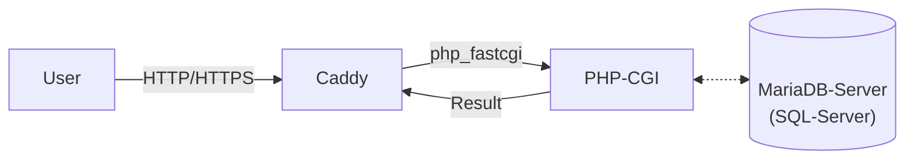

# caddy-php

tool for setting up a caddy-server with PHP support and optional MariaDB-server

## Warning

*MariaDB-support is still WIP!*

## About

After some research, I realized that there was no way to set up a caddy server with PHP support without much effort. That's why I created this repository. Later MariaDB-server support was integrated too.



## How to install

Download the `.ps1`-file from [here](./src/). Run the script in PowerShell with `.\caddy-php.ps1`.

The script

- will suggest available PHP versions and lets you choose.
- tries to choose the caddy version automatically but lets you choose when it has problems doing so.
- creates a subfolder named "caddy-php".

## How to run

```
php-cgi -b 127.0.0.1:9000
```

```
caddy run --watch
```

## Documentation

| Service | Documentation |
| --- | --- |
| Caddy | [Link](https://caddyserver.com/docs/command-line) |
| MariaDB | [Link](https://mariadb.com/kb/en/documentation/) |
| PHP | [Link](https://www.php.net/manual/en/features.commandline.options.php) |

## FAQ

<details><summary>Is it portable?</summary>
<p>
       The services used by this project are configured to work portable. Move your installation where you want.
</p>
</details>

<!--
<details><summary></summary>
<p>
       
</p>
</details>
-->

<details><summary>Why MariaDB?</summary>
<p>
       MariaDB is a open-source fork of MySQL. MariaDB provides better performance and more features than MySQL.<br>
       <a href="https://www.guru99.com/mariadb-vs-mysql.html">More Information on this topic</a>
</p>
</details>
